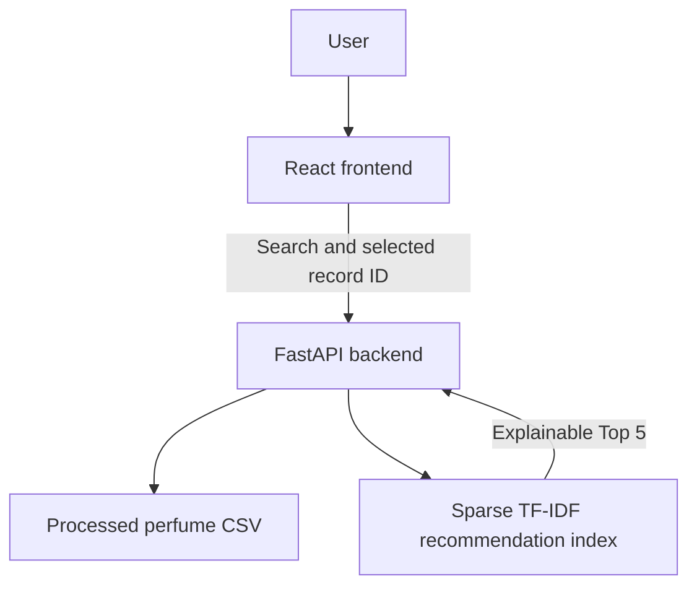

# Perfume Recommendation System

A full-stack perfume discovery application with a FastAPI backend, a React/TypeScript frontend, and an explainable content-based recommendation engine.

## Overview

Users search the 24,000+ perfume catalog, select a specific record, and receive up to five perfumes with genuinely similar olfactory profiles. Fragrance notes provide 95% of the similarity score; main accords provide a small 5% supporting signal. Ratings, review counts, brand, gender, price, and brand tier do not affect default similarity.

## Technology

- Backend: Python, FastAPI, Pandas, NumPy, SciPy, scikit-learn, Pydantic, and Uvicorn.
- Frontend: React, TypeScript, Vite, Tailwind CSS, and Radix UI components.
- Data: a processed CSV plus a versioned, sparse in-memory recommendation index.

## Architecture



Search returns a stable `perfume_id`; the frontend sends that ID to the recommendation endpoint. This prevents an exact selection such as `sauvage` from being replaced by a more popular substring match such as `sauvage-elixir`.

## Recommendation Pipeline

1. Keep the source top, middle/heart, and base note strings unchanged for display.
2. Build a separate normalized representation with parenthetical-aware parsing, whitespace/punctuation normalization, note de-duplication, and conservative aliases.
3. Preserve every multi-word note as one concept, such as `pink pepper`.
4. Keep specific variants distinct while adding a weak parent feature where safe. For example, `madagascar vanilla` is not collapsed into `vanilla`, but the two can receive a small related-variant signal.
5. Fit one perfume-level IDF vocabulary on the complete corpus.
6. Build and cache sparse weighted note, note-presence, pyramid-position, and accord matrices.
7. Calculate similarity against all aligned vector rows, apply only explicitly requested filters, exclude the selected identity, remove duplicate identities, and sort descending.

### Configurable pyramid weights

- Top: `1.0`
- Middle/heart: `1.25`
- Base: `1.5`

These values preserve the greater importance of sustained heart/base notes while giving better whole-profile, same-position, and accord-agreement metrics than both the old `3/2/1` scheme and more aggressive base weighting in the reproducible dataset sample.

### Similarity formula

```text
final_similarity =
    0.65 * weighted_tfidf_cosine
  + 0.20 * idf_weighted_note_jaccard
  + 0.10 * same_position_pyramid_jaccard
  + 0.05 * main_accord_jaccard
```

All components are in `[0, 1]`. If optional accord data is absent for the query, its 5% is redistributed across the available note-derived components. Popularity is not part of the formula.

Brand-tier and minimum-review filters remain available as explicit API options for compatibility, but both are off by default and never change the underlying similarity values.

See [RECOMMENDATION_AUDIT.md](RECOMMENDATION_AUDIT.md) for the pre-change flow, data-quality measurements, root causes, and design rationale.

## Getting Started

### Backend

From the repository root:

```powershell
.\.venv\Scripts\Activate.ps1
pip install -r backend\requirements.txt
cd backend
python -m uvicorn main:app --reload
```

The first run builds `data/processed/model_v2.pkl`. Subsequent runs load that versioned sparse cache.

### Frontend

In a second terminal:

```powershell
cd frontend
npm install
npm run dev
```

Open `http://localhost:5173/`. The API runs on `http://127.0.0.1:8000/`.

## Data

- Raw source: `data/raw/fra_cleaned.csv`
- Preprocessor: `backend/preprocess.py`
- Processed data: `data/processed/perfumes_processed.csv`
- Sparse derived cache: `data/processed/model_v2.pkl`

The current processed dataset has 24,063 perfumes and retains separate top, middle, and base note fields.

## Evaluation and Tests

Run the controlled synthetic tests:

```powershell
.\.venv\Scripts\python.exe -m unittest discover -s backend\tests -v
```

Generate an explainable Top-5 report for recognizable perfumes from the actual dataset:

```powershell
.\.venv\Scripts\python.exe backend\evaluate_recommendations.py
```

Pass custom queries as `brand:name`:

```powershell
.\.venv\Scripts\python.exe backend\evaluate_recommendations.py "dior:sauvage" "creed:aventus"
```

The report includes query notes, component scores, shared notes, query-note coverage, related variants, the most common normalized notes, and automated ranking/ID invariants.

## API

- `POST /search`: search by name and optional brand; returns stable perfume IDs.
- `POST /recommend`: return note-primary recommendations and debug explanations in metadata.
- `GET /health`: report API health and sparse-index diagnostics.
- `GET /brands`: list brands.
- `GET /tiers`: list the optional compatibility tier mapping.

## License

This project is for educational and demonstration purposes.
